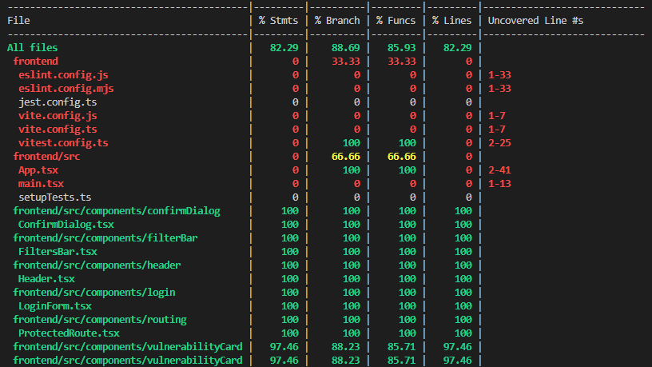

# Vulnerability Manager

A modern web application for tracking and managing security vulnerabilities, built with **React**, **TypeScript**, **Sass**, and **Node.js (Express)**. Features role-based access control, JWT authentication, and a modern, responsive design inspired by Strike.sh.


## Features
- **Authentication & Authorization**
  - JWT-based authentication 
  - Role-based access control (Admin/User roles) 
  - Protected routes and API endpoints
  - Persistent sessions

  ## [PR-JWT-AUTH](https://github.com/IvanMJs/strike-challenge/pull/4)
  ## [PR-ROLE-SUPPORT](https://github.com/IvanMJs/strike-challenge/pull/3)

- **Modern UI/UX Design**
  - Stunning video background with gradient overlay
  - Glassmorphism effect throughout the interface
  - Responsive pill-shaped navigation
  - Mobile-first design with hamburger menu
  - Smooth animations and transitions
  - Premium look and feel
  - Optimized for all screen sizes

- **Vulnerability Management**
  - Create, view, edit, and delete vulnerabilities (based on role)
  - Track status with transitions (Pending Fix, In Progress, Under Review, etc.)
  - Filter and search by status, criticality, and keywords
  - Compact, responsive card grid layout
  - History of state changes
  - Custom confirmation dialogs
  - Form validation
  - Robust JSON payload validation with clear error messages

- **User Experience**
  - Modern, clean UI with Sass styling
  - Intuitive navigation and layout
  - Role-specific UI elements
  - Toast notifications for actions
  - Loading states and error handling
  - Responsive design optimized for all devices
  - Enhanced accessibility
  - Performance optimized

## Tech Stack
### Frontend
- **Framework:** React 18 with TypeScript
- **Build Tool:** Vite
- **Styling:** Sass (SCSS) with modern UI patterns:
  - Glassmorphism effects
  - CSS Grid for responsive layouts
  - CSS Variables for theming
  - Advanced animations
- **State Management:** Context API + Reducers
- **Routing:** React Router v6
- **HTTP Client:** Fetch API

### Backend
- **Runtime:** Node.js
- **Framework:** Express
- **Language:** TypeScript
- **Authentication:** JWT (jsonwebtoken)
- **Password Hashing:** bcryptjs
- **Testing:** Jest
- **Storage:** In-memory store (for demo purposes)
- **Error Handling:**
  - Comprehensive error middleware
  - Automatic JSON syntax validation
  - User-friendly error messages
  - Appropriate HTTP status codes (400 for malformed JSON)

## Project Structure
```
├── frontend/             # React/Vite Frontend Application
│   ├── src/
│   │   ├── components/   # React components
│   │   │   ├── confirmDialog/    # Confirmation dialog component
│   │   │   ├── filterBar/        # Filtering and search bar
│   │   │   ├── header/           # App header with auth status
│   │   │   ├── login/            # Authentication form
│   │   │   ├── routing/          # Protected route components
│   │   │   ├── vulnerabilityCard/# Individual vulnerability display
│   │   │   ├── vulnerabilityForm/# Create/Edit vulnerability form
│   │   │   └── vulnerabilityGrid/# Grid display of vulnerabilities
│   │   ├── context/     # React Context providers (Auth, Vulnerability)
│   │   ├── services/    # API service integrations
│   │   ├── types/       # TypeScript interfaces and types
│   │   ├── utils/       # Constants and utility functions
│   │   └── views/       # Main view components
│   ├── public/          # Static assets
│   └── __tests__/       # Frontend tests
│
└── backend/             # Node.js/Express Backend API
    ├── src/
    │   ├── api/         # API layer
    │   │   ├── controllers/  # Request handlers
    │   │   ├── middleware/   # Auth and validation middleware
    │   │   └── routes/       # API endpoint definitions
    │   ├── config/      # Environment and auth configuration
    │   ├── domain/      # Domain interfaces and types
    │   │   ├── interfaces/
    │   │   └── types/
    │   ├── middleware/  # Global middleware
    │   ├── scripts/     # Utility scripts
    │   ├── services/    # Business logic layer
    │   └── utils/       # Helper functions and constants
    └── tests/           # Backend integration tests
```

# CI/CD :
### GitHub Actions

## [PR Workflow Github Actions](https://github.com/IvanMJs/strike-challenge/pull/9/files#diff-f7d70e1bacea95e9c2008e5cbd7698c48ca63a1f4e7d4eb4d22d0b2db50f6aa6)

The project includes automated testing and coverage checks that run on pull requests to the main branch:

- **Test Coverage Workflow**  
  - Runs on every pull request to `main`
  - Executes both frontend and backend test suites
  - Enforces minimum 80% code coverage requirement
  - Uses Node.js 18.x
  - Separate coverage checks for frontend and backend

## Getting Started

### Prerequisites
- Node.js (v14 or higher)
- npm or yarn

### Installation and Setup

1. Clone the repository

2. Install frontend dependencies:
```bash
cd frontend
npm install
```

3. Install backend dependencies:
```bash
cd backend
npm install
```

4. Start the backend server (from the backend directory):
```bash
npm run dev
```

5. In a new terminal, start the frontend development server (from the root directory):
```bash
npm run dev
```

The application will be available at http://localhost:5173

## Authentication

The system includes two predefined users for testing:

1. Admin User
   - Username: admin
   - Password: admin123
   - Full access to all features (create, read, update, delete)

2. Regular User
   - Username: user
   - Password: user123
   - Limited access (create and read only)

## API Endpoints

### Authentication
- `POST /api/auth/login` - Authenticate user and receive JWT token

### Vulnerabilities
All endpoints require a valid JWT token in the Authorization header.

- `GET /api/vulnerabilities` - Get all vulnerabilities (Admin/User)
- `GET /api/vulnerabilities/:id` - Get a specific vulnerability (Admin/User)
- `POST /api/vulnerabilities` - Create a new vulnerability (Admin/User)
- `PUT /api/vulnerabilities/:id` - Update a vulnerability (Admin only)
- `DELETE /api/vulnerabilities/:id` - Delete a vulnerability (Admin only)

## Deployment

### Live Application
The application is deployed and accessible at:
- Frontend: [https://strike-challenge-iota.vercel.app/](https://strike-challenge-iota.vercel.app/)
- Backend API: [https://strike-challenge.onrender.com/](https://strike-challenge.onrender.com/)

### Deployment Configuration

#### Frontend (Vercel)
1. Connect your GitHub repository to Vercel
2. Configure the build settings:
   - Framework Preset: Vite
   - Root Directory: `frontend`
   - Build Command: `npm install && npm run build`
   - Output Directory: `dist`
   - Install Command: `npm install`

#### Backend (Render)
1. Connect your GitHub repository to Render
2. Create a new Web Service
3. Configure the service:
   - Root Directory: `backend`
   - Build Command: `npm install && npm run build`
   - Start Command: `npm start`
   - Environment Variables:
     - `NODE_ENV`: production
     - `PORT`: 10000

### Environment Setup for Deployment

#### Frontend Environment Variables
Create `.env.production` in the frontend directory:
```env
VITE_API_URL=https://strike-challenge.onrender.com
NODE_ENV=production
```

#### Backend Environment Variables
Set these in Render.com environment variables section:
```env
PORT=10000
NODE_ENV=production
```

## Development

### Environment Variables
The backend uses the following environment variables:
- `PORT` - Server port (default: 4000)
- `JWT_SECRET` - Secret key for JWT signing (default: development key)
- `JWT_EXPIRES_IN` - Token expiration time (default: 24h)

Create a `.env` file in the backend directory to customize these values.

### Adding New Features
1. Backend:
   - Add routes in `backend/src/api/routes`
   - Create controllers in `backend/src/api/controllers`
   - Add business logic in `backend/src/services`
   - Define types in `backend/src/domain/interfaces`

2. Frontend:
   - Create components in `src/components`
   - Add API services in `src/services`
   - Define types in `src/types`
   - Update context providers in `src/context`

## Testing and Coverage

### Running Tests

#### Backend Tests
Navigate to the backend directory and use one of the following commands:

```bash
# Run tests
npm test

# Run tests in watch mode
npm run test:watch

# Run tests with coverage report
npm run test:coverage
```

#### Frontend Tests
Navigate to the frontend directory and use one of the following commands:

```bash
# Run tests
npm test

# Run tests in watch mode
npm run test:watch

# Run tests with coverage report
npm run test:coverage
```

### Coverage Report :

# Backend Coverage
### PR to implementation: [PR BACKEND TEST COVERAGE](https://github.com/IvanMJs/strike-challenge/pull/5)

After running tests with coverage, you can find the detailed coverage report in:
- HTML format: `backend/coverage/lcov-report/index.html`
- Console output showing:
  - Statement coverage
  - Branch coverage
  - Function coverage
  - Line coverage

The coverage report breaks down test coverage by:
- Controllers (auth, vulnerabilities)
- Middleware
- Services
- Utils

 


# Frontend Coverage
### PR to implementation: [PR FRONTEND TEST COVERAGE](https://github.com/IvanMJs/strike-challenge/pull/7)

Frontend coverage report is available at:
- HTML format: `frontend/coverage/lcov-report/index.html`

The frontend test suite includes comprehensive coverage of:
- Component Tests
  - VulnerabilityView (full CRUD operations)
  - VulnerabilityForm (input validation, submission)
  - VulnerabilityGrid (display, filtering)
  - FiltersBar (search, status filters)
  - ConfirmDialog (delete confirmation)
- Context Tests
  - AuthContext (authentication state)
  - VulnerabilityContext (state management)
- Reducer Tests
  - vulnerabilityReducer (state updates)
- Utility Tests
  - storage (localStorage handling)
  - constants (type validation)

Key testing features:
- Async operation testing
- Form validation
- Error handling
- User interactions
- Role-based access control
- State management
- API integration
- Middleware (authentication, error handling)
- Services
- Utils



### Test Organization
Tests are organized in the `backend/tests` and `frontend/tests` directory:


## License
This project is licensed under the MIT License.
```sh
git clone https://github.com/your-username/strike-challenge.git
cd strike-challenge
```

### 2. Install dependencies
For the frontend:
```sh
cd frontend
npm install
```

For the backend:
```sh
cd backend
npm install
```

### 3. Start the backend API
```sh
cd backend
npm run build  # Build TypeScript files
npm start      # Start the server
```
The backend will run on [http://localhost:4000](http://localhost:4000)

For development with auto-reload:
```sh
npm run dev
```

### 4. Start the frontend (React)
```sh
npm run dev
```
The frontend will run on [http://localhost:5173](http://localhost:5173)

## Development
- Frontend and backend are both written in TypeScript for type safety
- Use `npm run build` to compile TypeScript files
- Use `npm run dev` for development with hot-reload
- Run tests with `npm test`

## API Endpoints
- `GET /api/vulnerabilities` - List all vulnerabilities
- `POST /api/vulnerabilities` - Create a new vulnerability
- `PUT /api/vulnerabilities/:id` - Update a vulnerability
- `DELETE /api/vulnerabilities/:id` - Delete a vulnerability

## Notes
- This project uses an in-memory backend for demo purposes. All data will reset when the server restarts.
---

**Made for the Strike Challenge.**
